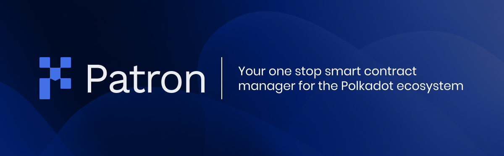

#



Patron is created by [Brushfam](https://brushfam.io/) team as unified solution for smart 
contract verification. First, it provides a developer-oriented CLI that allows to 
deploy and verify a contract in one step. Patron uses [Astar network](https://astar.network/) 
for deployment. Another part of the project is [Patron UI](https://patron.works/), where you can 
find smart contracts by their address or hash code and see the data of contracts.

Start using the CLI by installing it using Cargo:

```sh
cargo install patron --git https://github.com/brushfam/patron-backend
```

For more information on the CLI check the [dedicated documentation](./docs/cli.md).

You can also [self-host](./docs/self-hosted.md) Patron to utilize your own infrastructure.
